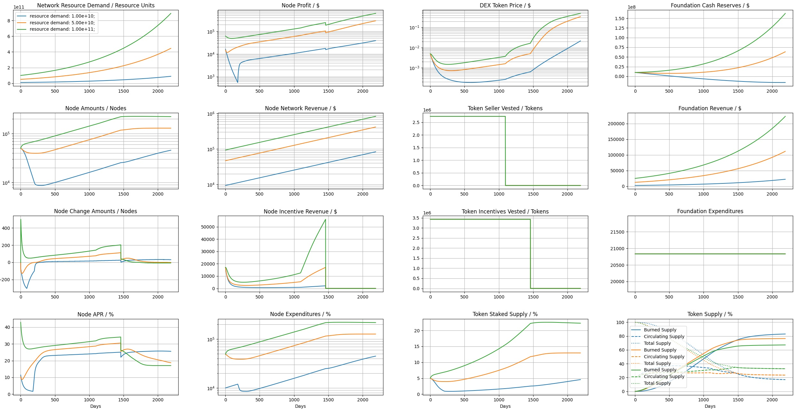

# DePIN Simulator
This tool is work in progress and meant to serve as an initial template that requires customization and adjustments based on the respective DePIN economy.

A tool to forecast and optimize the token economics of DePIN networks.

## Disclaimer
MUST READ:
The DePIN simulator and accompanying information provided on this document has been prepared  by Outlier Ventures (“OV”) for educational and general information purposes only. No undertaking, warrant or other assurance is given, and none should be implied, as to, and no reliance should be placed on the accuracy, adequacy, validity, reliability, fairness or completeness of any information in the DePIN simulator or the document. The DePIN simulator and information should not be considered a recommendation by OV or any of its directors, officers, employees, agents or advisers in connection with your token model. The information contained in the DePIN simulator  has been prepared purely for informational purposes. In all cases persons should conduct their own investigation and analysis of the data in the DePIN simulator. Under no circumstances shall OV have any liability for any loss or damage of any kind incurred as a result of the use of, or reliance on, the DePIN simulator. The use of the information contained in the DePIN simulator is solely at the user’s own risk.

## Installation

Python 3.9 is recommended!

- Clone this repository to your local machine by `git clone https://github.com/OutlierVentures/DePINSimulator.git`
- Create a new Python environment in the projects directory by `python -m venv venv`
- Activate the new environment by `venv/bin/activate`
- Install all required packages by `pip install -r requirements.txt`

## Usage
- Make sure you followed the previous installation section.
- Navigate with your terminal to the main project directory.
- Change the simulation input parameters in `./model/sys_params.py` for the simulation according to your preferences.
- Run `python DePIN_Simulator.py` within the previously installed and activated environment.

## Example Results

## Development Roadmap

*Based on "Designing DePIN Protocols Using Optimal Control Theory" by [Volt Capital](https://volt.capital/blog/designing-depin-protocols-using-optimal-control-theory)*

### Phase 1: Foundation & Cost Function Framework ✅ **COMPLETE**
- ✅ **Cost Function Implementation**: Full `J(x_0, π)` framework with 5 cost components
  - Price stability cost (30% weight)
  - Utilization efficiency cost (25% weight)
  - Foundation sustainability cost (20% weight) 
  - Node profitability cost (15% weight)
  - Decentralization cost (10% weight)
- ✅ **Real-time Policy Evaluation**: Cost calculated at each simulation timestep
- ✅ **Mathematical Foundation**: radCAD-based dynamical systems modeling
- ✅ **Model Validation & Volt Capital Fixes**:
  - ✅ Network utilization capped at 100% (physically realistic)
  - ✅ Economic constraint: can't sell more resources than network provides
  - ✅ Stable cost function calculation without infinite/NaN values
  - ✅ 30-day simulation validation successful

### Phase 2: Optimal Control Theory & BME Controllers
- [ ] **Burn-and-Mint Equilibrium (BME) Controllers**
  - [ ] Implement BME 50%, 75%, 100% burn rate variants
  - [ ] Compare BME policies vs current approach using cost function
  - [ ] Dynamic emission control with stability constraints
- [ ] **Control Framework**
  - [ ] Policy action vectors for token burn/mint decisions
  - [ ] Automated policy optimization using cost minimization
  - [ ] Multi-policy comparison and ranking system
- [ ] **Value Function Approximation**
  - [ ] Reinforcement learning for policy discovery
  - [ ] Bellman equation solvers for optimal policies

### Phase 3: Interactive UI & Visualization
- [ ] **Streamlit Advanced Interface** 
  - [ ] **Cost function visualization and dashboards**
  - [ ] Real-time policy comparison tools
  - [ ] Interactive parameter exploration
  - [ ] Multi-scenario stress testing
- [ ] **Protocol Design Tools**
  - [ ] Policy designer with cost function feedback
  - [ ] Target optimization criteria configuration
  - [ ] Export/import protocol configurations

### Phase 4: Advanced Analytics & Research Tools
- [ ] **Stress Testing Framework**
  - [ ] Exogenous shock simulation (demand volatility, macro events)
  - [ ] Attack vector analysis and protocol security assessment
  - [ ] Economic sustainability boundary testing
- [ ] **Machine Learning Integration**
  - [ ] Predictive modeling for demand forecasting
  - [ ] Automated hyperparameter optimization
  - [ ] Pattern recognition in protocol behavior

### Phase 5: Production Framework
- [ ] **API & Integration**
  - [ ] RESTful API for external tool integration
  - [ ] Real-time data pipeline support
  - [ ] Multi-protocol comparison platform
- [ ] **Research Platform**
  - [ ] Academic paper generation tools
  - [ ] Reproducible research framework
  - [ ] Open dataset publication for DePIN research

---

**Current Status**: Cost function framework complete! The simulator now provides objective policy evaluation using optimal control theory. Visual dashboards and policy comparison tools will be added with the Streamlit UI in Phase 3.