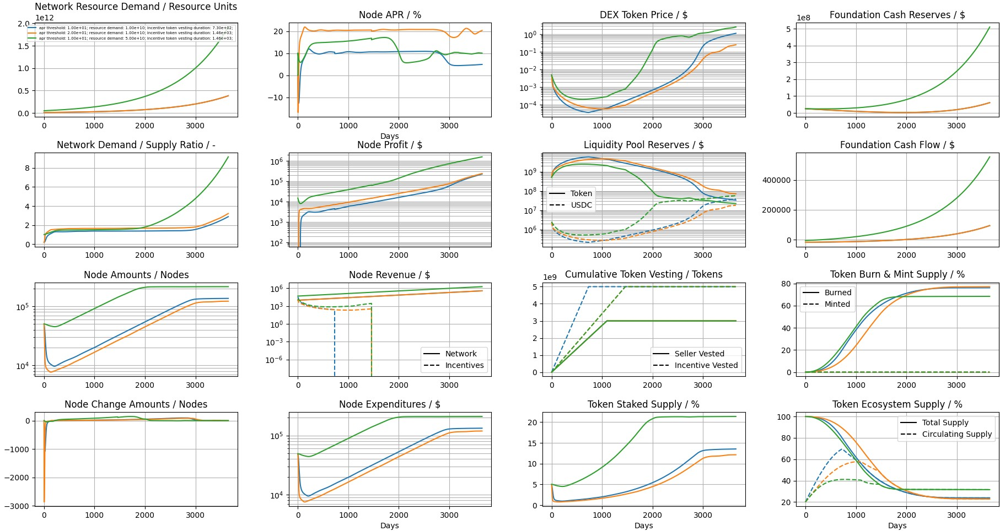

# DePIN Simulator
This tool is work in progress and meant to serve as an initial template that requires customization and adjustments based on the respective DePIN economy.

A tool to forecast and optimize the token economics of DePIN networks.

## Disclaimer
MUST READ:
The DePIN simulator and accompanying information provided on this document has been prepared  by Outlier Ventures (“OV”) for educational and general information purposes only. No undertaking, warrant or other assurance is given, and none should be implied, as to, and no reliance should be placed on the accuracy, adequacy, validity, reliability, fairness or completeness of any information in the DePIN simulator or the document. The DePIN simulator and information should not be considered a recommendation by OV or any of its directors, officers, employees, agents or advisers in connection with your token model. The information contained in the DePIN simulator  has been prepared purely for informational purposes. In all cases persons should conduct their own investigation and analysis of the data in the DePIN simulator. Under no circumstances shall OV have any liability for any loss or damage of any kind incurred as a result of the use of, or reliance on, the DePIN simulator. The use of the information contained in the DePIN simulator is solely at the user’s own risk.

## Installation

Python 3.9 is recommended!

- Clone this repository to your local machine by `git clone https://github.com/OutlierVentures/DePINSimulator.git`
- Create a new Python environment in the projects directory by `python -m venv venv`
- Activate the new environment by `venv/bin/activate`
- Install all required packages by `pip install -r requirements.txt`

## Usage
- Make sure you followed the previous installation section.
- Navigate with your terminal to the main project directory.
- Change the simulation input parameters in `./model/sys_params.py` for the simulation according to your preferences.
- Run `python DePIN_Simulator.py` within the previously installed and activated environment.

## Example Results
