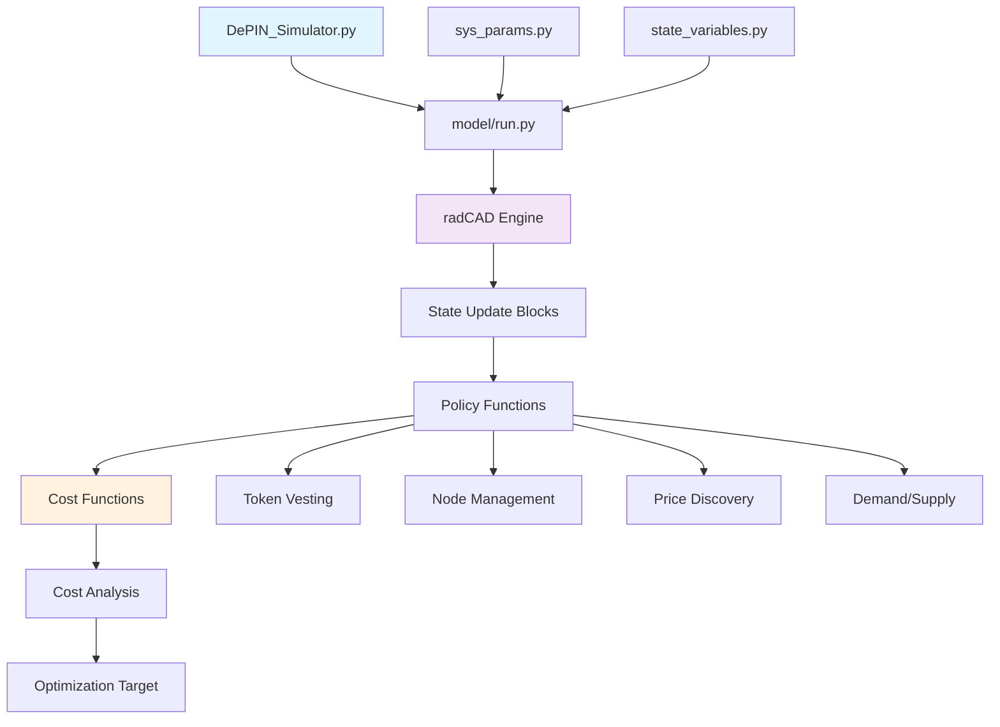
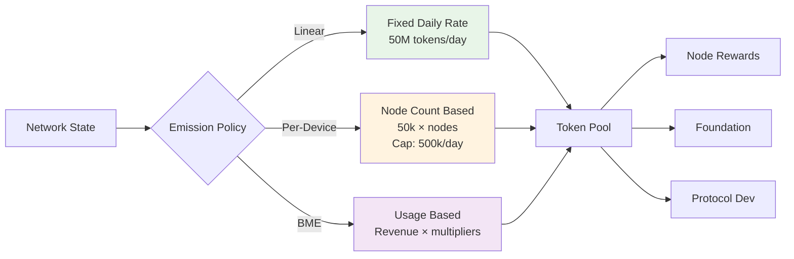
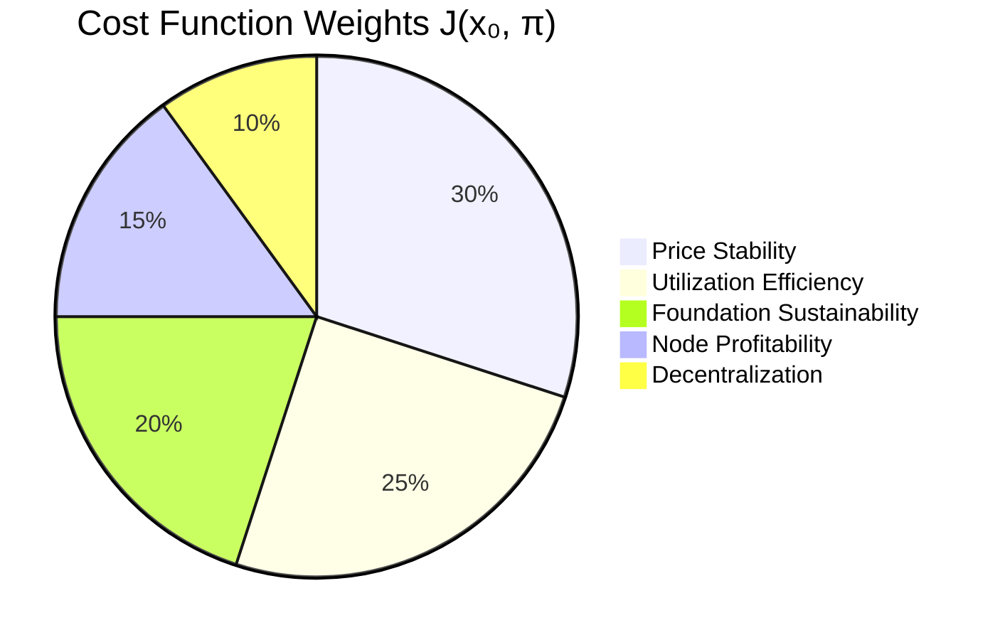

# DePIN Simulator - Technical Setup Guide

## Table of Contents
1. [Environment Setup](#environment-setup)
2. [System Architecture](#system-architecture)
3. [Emission Policies Framework](#emission-policies-framework)
4. [Cost Function Framework](#cost-function-framework)
5. [radCAD Integration](#radcad-integration)
6. [Running Simulations](#running-simulations)
7. [Testing & Validation](#testing--validation)
8. [Troubleshooting](#troubleshooting)

---

## Environment Setup

### Prerequisites
- Python 3.9+
- Conda package manager
- Git

### Installation Steps

1. **Clone the Repository**
```bash
git clone <repository-url>
cd DePINSimulator
```

2. **Create Conda Environment**
```bash
conda create -n depin python=3.9
conda activate depin
```

3. **Install Dependencies**
```bash
pip install -r requirements.txt
```

### Critical Environment Notes
🚨 **ALWAYS use the depin conda environment**:
- All Python commands must run with: `conda activate depin && python script.py`
- Never run in base environment (causes pandas/numpy compatibility issues)
- Environment activation is required for every terminal session

---

## System Architecture

### Project Structure
```
DePINSimulator/
├── DePIN_Simulator.py           # Main simulation entry point
├── model/                       # Core simulation logic
│   ├── policy_functions.py      # Business logic & controllers (325+ lines)
│   ├── cost_functions.py        # Optimal control theory framework (289 lines)
│   ├── state_update_functions.py # radCAD state transitions
│   ├── state_update_blocks.py   # radCAD integration layer
│   ├── sys_params.py           # Configuration parameters
│   ├── state_variables.py      # Initial state definition
│   ├── run.py                  # Simulation execution
│   └── utils.py                # Helper functions (PID controller)
├── tests/                      # Test suite (newly added)
│   └── diagnostics/           # Diagnostic tests
├── requirements.txt           # Dependencies
└── README.md                 # Project overview
```

### Component Interaction Flow



---

## Emission Policies Framework

The DePIN Simulator implements three distinct emission policies during the bootstrap phase:

### 1. Linear Emission Policy (Default)
**Concept**: Fixed daily token emission regardless of network activity.

**Configuration**:
```python
emission_policy = 'linear'
daily_emission_target = 50_000_000  # tokens per day
```

**Formula**: `daily_emission = daily_emission_target`

**Use Case**: Predictable tokenomics, simple treasury management

### 2. Per-Device Emission Policy  
**Concept**: Emission scales with active node count.

**Configuration**:
```python
emission_policy = 'per_device'
emission_per_device = 50_000      # tokens per node per day
daily_emission_cap = 500_000      # maximum daily emission
```

**Formula**: 
```python
base_emission = active_nodes × emission_per_device
daily_emission = min(base_emission, daily_emission_cap)
```

**Use Case**: Growth incentivization, node acquisition focus

### 3. BME (Burn-and-Mint Equilibrium) Policy
**Concept**: Usage-driven emission based on network revenue.

**Configuration**:
```python
emission_policy = 'bme'
bme_burn_rate_multiplier = 1.0    # burn equivalent calculation
bme_mint_rate_multiplier = 1.0    # mint rate from burn equivalent
```

**Formula**:
```python
burn_equivalent = network_sold_resource × resource_unit_price × burn_multiplier
daily_emission = burn_equivalent × mint_multiplier
```

**Use Case**: Market-driven tokenomics, utility-based emission

### Emission Policy Comparison



### Budget Allocation System
All emission policies respect the same budget allocation framework:

```python
# Allocation percentages (must sum to 1.0)
foundation_allocation = 0.20      # 20% to foundation
protocol_dev_allocation = 0.15   # 15% to protocol development  
node_reward_allocation = 0.65     # 65% to node operators
```

**Validation**: The system enforces `foundation_allocation + protocol_dev_allocation + node_reward_allocation = 1.0`

---

## Cost Function Framework

The simulator implements J(x₀, π) optimal control cost function with 5 weighted components:

### Cost Function Components



### 1. Price Stability Cost (30% weight)
**Target**: Maintain stable token price around target value
**Formula**: `|current_price - target_price| / target_price`

### 2. Utilization Efficiency Cost (25% weight)  
**Target**: Optimize network resource utilization
**Formula**: `|actual_utilization - target_utilization| / target_utilization`

### 3. Foundation Sustainability Cost (20% weight)
**Target**: Ensure adequate foundation funding
**Formula**: `max(0, min_foundation_balance - current_balance) / min_foundation_balance`

### 4. Node Profitability Cost (15% weight)
**Target**: Maintain profitable node operations
**Formula**: `max(0, min_profit_margin - current_margin) / min_profit_margin`

### 5. Decentralization Cost (10% weight)
**Target**: Promote network decentralization
**Formula**: Based on node distribution metrics

### Cost Function Integration

```mermaid
flowchart TD
    A[Simulation State] --> B[Cost Component 1<br/>Price Stability 30%]
    A --> C[Cost Component 2<br/>Utilization 25%]
    A --> D[Cost Component 3<br/>Foundation 20%]
    A --> E[Cost Component 4<br/>Node Profit 15%]
    A --> F[Cost Component 5<br/>Decentralization 10%]
    
    B --> G[Weighted Sum<br/>J(x₀, π)]
    C --> G
    D --> G
    E --> G
    F --> G
    
    G --> H[Optimization Target]
    H --> I[Policy Evaluation]
    
    style G fill:#ffebee
    style H fill:#e8f5e8
```

---

## radCAD Integration

### Execution Model
radCAD processes simulations in discrete timesteps with multiple substeps per timestep.

**Critical Understanding**: 
- Each timestep has 11 substeps (blocks)
- Substeps execute sequentially: Block 1 → Block 2 → ... → Block 11
- Final state values are in the **last substep** (substep 11)

### Block Execution Order

```mermaid
flowchart LR
    A[Timestep N] --> B[Block 1<br/>Initialization]
    B --> C[Block 2<br/>Token Vesting]
    C --> D[Block 3<br/>Price Updates]
    D --> E[Block 4<br/>Demand Calc]
    E --> F[Block 5<br/>Supply Calc]
    F --> G[Block 6<br/>Utilization]
    G --> H[Block 7<br/>Revenue]
    H --> I[Block 8<br/>Cost Analysis]
    I --> J[Block 9<br/>Node Changes]
    J --> K[Block 10<br/>Balances]
    K --> L[Block 11<br/>Final State]
    
    L --> M[Timestep N+1]
    
    style C fill:#ffebee
    style J fill:#e3f2fd
    style L fill:#e8f5e8
```



### Critical Timing Issue
**Problem**: Token vesting (Block 2) runs before node initialization (Block 9)
**Impact**: At timestep 1, `node_amount = 0` when BME calculations run
**Solution**: Policies use `prev_state['timestep'] > 1` checks and fallback logic

### Policy Function Structure
All policy functions follow this pattern:
```python
def p_function_name(params, substep, state_history, prev_state, **kwargs):
    # Extract parameters
    param_value = params['param_name']
    
    # Get previous state
    current_value = prev_state['state_variable']
    
    # Apply business logic
    new_value = calculate_update(current_value, param_value)
    
    # Return state update
    return {'state_variable': new_value}
```

### State Update Functions
State update functions integrate policy outputs:
```python
def s_state_variable(params, substep, state_history, prev_state, policy_input):
    return policy_input['state_variable']
```

---

## Running Simulations

### Basic Simulation
```bash
conda activate depin
python DePIN_Simulator.py
```

### Configuration Options

#### 1. Change Emission Policy
Edit `model/sys_params.py`:
```python
# Options: 'linear', 'per_device', 'bme'
'emission_policy': ['linear']
```

#### 2. Adjust Simulation Duration
```python
# Timesteps (days)
timesteps = 3650  # 10 years
```

#### 3. Parameter Sweeps
```python
# Multiple values for parameter sweeps
'daily_emission_target': [30_000_000, 50_000_000, 70_000_000]
```

### Advanced Simulation Example
```python
# Custom configuration
params = {
    'emission_policy': ['bme'],
    'bme_burn_rate_multiplier': [0.8, 1.0, 1.2],
    'bme_mint_rate_multiplier': [0.9, 1.0, 1.1],
    'timesteps': [365]  # 1 year
}
```

### Output Analysis
Simulation outputs include:
- Token emission patterns
- Price dynamics  
- Network utilization metrics
- Cost function evolution
- Node profitability analysis

---

## Testing & Validation

### Test Categories

#### 1. Unit Tests
Located in `tests/` directory:
```bash
# Run specific test
conda activate depin && python tests/diagnostics/bme_emission_policy_test.py
```

#### 2. Emission Policy Validation
Tests all three emission policies:
```bash
conda activate depin && python tests/diagnostics/phase_1_5_completion_validation.py
```

**Expected Results**:
- Linear: ~205M tokens over 30 days (consistent daily emission)
- Per-Device: ~15M tokens over 30 days (node-scaled, capped)
- BME: ~232k tokens over 30 days (usage-driven, variable)

#### 3. Cost Function Tests
Validates mathematical precision and constraint compliance:
- Weight conservation (sum = 1.0)
- Numerical stability
- Boundary condition handling

### Debugging Tools

#### radCAD State Inspection
```python
# Access final substep data
final_data = df[df['substep'] == 11]

# Or use iloc for last entry per timestep
final_state = df.groupby('timestep').iloc[-1]
```

#### Common Validation Patterns
```python
# Check token allocation conservation
total_allocation = (foundation_allocation + 
                   protocol_dev_allocation + 
                   node_reward_allocation)
assert abs(total_allocation - 1.0) < 1e-10

# Validate economic constraints  
assert demand_supply_ratio <= 1.0
assert token_price >= 0
assert node_amount >= 0
```

---

## Troubleshooting

### Common Issues

#### 1. Environment Problems
**Symptoms**: Import errors, pandas compatibility issues
**Solution**: Always use `conda activate depin` before running any Python commands

#### 2. Zero Emission in BME
**Symptoms**: BME shows 0 tokens instead of expected values
**Diagnosis**: Check substep extraction - use final substep data
**Solution**: Use `df.groupby('timestep').last()` or `df[df['substep'] == 11]`

#### 3. Parameter Validation Errors
**Symptoms**: Assertion errors about allocation sums
**Diagnosis**: Budget allocations don't sum to 1.0
**Solution**: Verify all allocation parameters sum exactly to 1.0

#### 4. Node Count Issues
**Symptoms**: Division by zero, unexpected node_amount = 0
**Diagnosis**: radCAD block execution order
**Solution**: Add timestep checks: `if prev_state['timestep'] > 1:`

### Performance Optimization

#### Large Simulations
For simulations >1000 timesteps:
- Use progress indicators
- Consider parameter sweep parallelization
- Monitor memory usage

#### Numerical Stability
- Add epsilon values for division operations
- Use numpy operations for mathematical calculations
- Validate intermediate results

### Validation Checklist
Before deploying configuration changes:
- [ ] Budget allocations sum to 1.0
- [ ] Parameter ranges are economically feasible  
- [ ] Emission policy is spelled correctly
- [ ] Test with short simulation first (30 days)
- [ ] Verify cost function weights sum to 1.0
- [ ] Check for negative values in financial metrics

---

## Advanced Features

### Parameter Sensitivity Analysis
Run multiple simulations with parameter variations:
```python
# Example: BME sensitivity analysis
burn_multipliers = [0.5, 0.8, 1.0, 1.2, 1.5]
mint_multipliers = [0.8, 0.9, 1.0, 1.1, 1.2]

for burn in burn_multipliers:
    for mint in mint_multipliers:
        # Run simulation with parameters
        params['bme_burn_rate_multiplier'] = [burn]
        params['bme_mint_rate_multiplier'] = [mint]
        results = run_simulation(params)
```

### Custom Policy Development
To add new emission policies:

1. **Extend policy_functions.py**:
```python
elif emission_policy == 'custom_policy':
    # Implement custom logic
    daily_emission = calculate_custom_emission(prev_state, params)
```

2. **Add parameters to sys_params.py**:
```python
'custom_policy_parameter': [default_value]
```

3. **Create validation tests**:
```python
def test_custom_policy():
    # Implement policy-specific tests
    assert expected_behavior()
```

### Real-time Monitoring
For long simulations, implement progress tracking:
```python
from tqdm import tqdm

# Add to run.py or custom runner
for timestep in tqdm(range(timesteps), desc="Simulation Progress"):
    # Simulation logic
    pass
```

---

## Research Applications

### Optimal Control Theory
The framework supports policy optimization research:
- Compare emission policies across cost function metrics
- Analyze parameter sensitivity for protocol design
- Evaluate trade-offs between decentralization and efficiency

### Economic Model Validation
Use the simulator to validate:
- Token economic assumptions
- Market mechanism effectiveness
- Long-term sustainability scenarios

### Protocol Design
Support protocol designers with:
- Parameter recommendation analysis
- Stress testing extreme scenarios
- Multi-objective optimization studies

---

This guide provides comprehensive technical documentation for the DePIN Simulator. For updates and advanced usage patterns, refer to the project's LLMLOG.MD and source code documentation. 